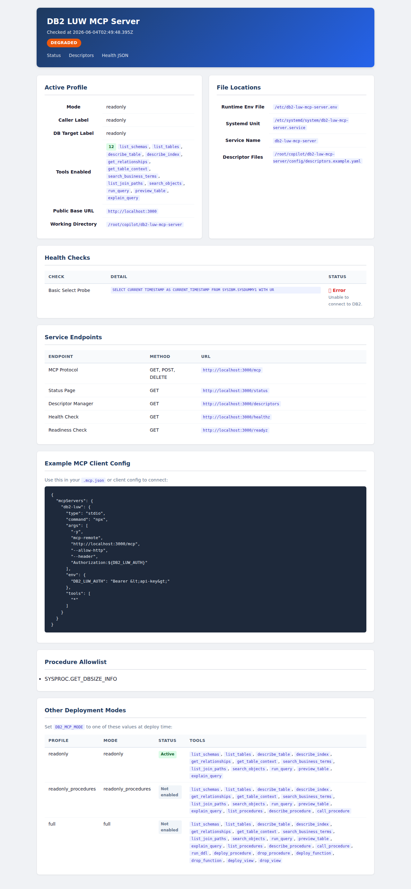
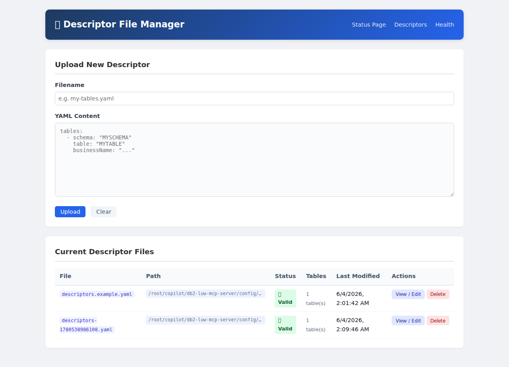

# DB2 LUW MCP Server

Standalone internal MCP server for IBM DB2 LUW. Single-mode, env-var-driven, and uses direct `ibm_db` connectivity with guarded read-only query support plus allowlisted stored procedures and full DDL tools.

## WARNINGS

:warning: This is still in ALPHA! I am running this locally on a Proxmox server - pull from OCI repo, deploy as LXC with template - Set the environment variables. Expect more updates as I find bugs or need new features. Feel free to add features and bug fixes via PRs.

:warning: This was purely vibe coded.

## Motivation

I wanted to leverage AI to accelerate DB2 DevOps and ITOps. There are a few other DB2 LUW MCP servers out there, however they weren't fully baked or missing core features like DDL capabilities.

- **readonly** — safe for power users to allow their AI agents to query for data
- **readonly_procedures** — for more advanced power users and IT controlled AI agents. Good for ITOps that need to diagnose and resolve problems
- **full** — for dev and IT controlled agents. For development, point to your test DB2 instance

## Quick start

```bash
# Required
export DB2_MCP_MODE=readonly
export DB2_MCP_API_KEY=sk-your-api-key

# Connection vars
export DB2_MCP_CONNECTION_STRING_DATABASE=SAMPLE
export DB2_MCP_CONNECTION_STRING_HOSTNAME=db2.internal
export DB2_MCP_CONNECTION_STRING_PORT=50000
export DB2_MCP_CONNECTION_STRING_PROTOCOL=TCPIP
export DB2_MCP_CONNECTION_STRING_UID=mcp_user
export DB2_MCP_CONNECTION_STRING_PWD=secret

# Start HTTP server
npm start

# Or stdio mode
npm run start:stdio
```

One container, one mode. All tools for that mode are derived automatically. No YAML config files needed.

## Screenshots

### Status Page
`GET /status` — health checks, file locations, tool inventory, and MCP client config.



### Descriptor File Manager
`GET /descriptors` — upload, view, edit, and delete business-context descriptor files.



## Environment variables

### Connection

| Variable | Required | Default | Purpose |
|---|---|---|---|
| `DB2_MCP_CONNECTION_STRING_DATABASE` | **Yes** | — | DB2 database name |
| `DB2_MCP_CONNECTION_STRING_HOSTNAME` | **Yes** | — | DB2 hostname or IP |
| `DB2_MCP_CONNECTION_STRING_UID` | **Yes** | — | DB2 username |
| `DB2_MCP_CONNECTION_STRING_PWD` | **Yes** | — | DB2 password |
| `DB2_MCP_CONNECTION_STRING_PORT` | No | `50000` | DB2 port |
| `DB2_MCP_CONNECTION_STRING_PROTOCOL` | No | `TCPIP` | DB2 protocol |

### Server

| Variable | Required | Default | Purpose |
|---|---|---|---|
| `DB2_MCP_MODE` | **Yes** | — | `readonly`, `readonly_procedures`, or `full` |
| `DB2_MCP_API_KEY` | **Yes** | — | Bearer token for MCP requests |
| `DB2_MCP_HOST` | No | `0.0.0.0` | Listen address |
| `DB2_MCP_PORT` | No | `3000` | Listen port |
| `DB2_MCP_PUBLIC_BASE_URL` | No | — | Public URL for SSE endpoint |
| `DB2_MCP_MAX_ROWS` | No | `1000` | Hard row cap |
| `DB2_MCP_DEFAULT_PREVIEW_ROWS` | No | `50` | Default preview limit |
| `DB2_MCP_QUERY_TIMEOUT_MS` | No | `30000` | Query timeout |
| `DB2_MCP_METADATA_TIMEOUT_MS` | No | `15000` | Metadata query timeout |
| `DB2_MCP_REQUEST_BODY_BYTES` | No | `1048576` | Max POST body size |
| `DB2_MCP_CALLER_LABEL` | No | *(mode name)* | Audit log identifier |
| `DB2_MCP_DB_LABEL` | No | *(mode name)* | Audit log DB target label |
| `DB2_MCP_PROCEDURE_ALLOWLIST` | No | — | Comma-separated `SCHEMA.NAME` entries |
| `LOG_LEVEL` | No | `info` | Pino log level |

### Descriptors

| Variable | Required | Default | Purpose |
|---|---|---|---|
| `DB2_MCP_DESCRIPTOR_FILES` | No | — | Comma-separated absolute paths to YAML descriptor files to load at startup. Missing files are silently skipped. |
| `DB2_MCP_DESCRIPTOR_UPLOAD_DIR` | No | `/app/config` | Directory for descriptor uploads via the web UI (must be writable by the node user). |
| `DB2_MCP_CONFIG_PATH` | No | — | Path to config file (used to resolve the descriptor directory when neither `DESCRIPTOR_UPLOAD_DIR` nor `DESCRIPTOR_FILES` is set). |
| `DB2_MCP_CONFIG_DIR` | No | `/app/config` | Config directory (final fallback for descriptor upload directory). |

**Descriptor directory resolution** (determines where uploaded files are saved):
1. `DB2_MCP_DESCRIPTOR_UPLOAD_DIR`
2. Directory of the first file in `DB2_MCP_DESCRIPTOR_FILES`
3. Directory of `DB2_MCP_CONFIG_PATH`
4. `DB2_MCP_CONFIG_DIR`
5. `/app/config`

Descriptors can be uploaded and hot-reloaded via the `/descriptors` UI **without** setting `DB2_MCP_DESCRIPTOR_FILES`. To persist uploaded descriptors across restarts, list them in `DB2_MCP_DESCRIPTOR_FILES`.

## What it includes

- Streamable HTTP MCP endpoint at `/mcp`
- Compatibility alias at `/` for simpler MCP HTTP clients
- Public `GET /healthz`, `GET /readyz`, and `GET /status`
- API-key auth with single profile per container
- Read-only metadata/query tools plus allowlisted stored procedure execution
- Full-mode deploy/drop tools for stored procedures, functions, and views
- Full-mode generic `run_ddl` support for broader schema-definition work
- Optional stdio entrypoint for local `npx` / linked-command use
- Linux container packaging plus Azure DevOps and GitHub Actions pipeline assets
- Optional YAML descriptor catalog for business-term search and relationship hints
- Web-based descriptor file manager (`GET /descriptors`)

## Repository contents

| Path | Purpose |
|---|---|
| `.env.example` | Environment variable reference |
| `config/descriptors.example.yaml` | Example descriptor catalog |
| `scripts/deploy-linux-mcp.sh` | Linux container / VM deployment script |
| `scripts/start-readonly-mcp.ps1` | Windows local HTTP starter |
| `scripts/start-readonly-stdio-mcp.ps1` | Windows local stdio starter |
| `scripts/start-readonly-stdio-npx.ps1` | Windows local tarball `npx` starter |

## Commands

- `npm run build`
- `npm run test`
- `npm run dev`
- `npm run dev:stdio`
- `npm start`
- `npm run start:stdio`

## Tools by mode

| Tool | readonly | readonly_procedures | full |
|---|---|---|---|
| `run_query` | ✅ | ✅ | ✅ |
| `explain_query` | ✅ | ✅ | ✅ |
| `preview_table` | ✅ | ✅ | ✅ |
| `list_schemas` | ✅ | ✅ | ✅ |
| `list_tables` | ✅ | ✅ | ✅ |
| `describe_table` | ✅ | ✅ | ✅ |
| `describe_index` | ✅ | ✅ | ✅ |
| `get_relationships` | ✅ | ✅ | ✅ |
| `get_table_context` | ✅ | ✅ | ✅ |
| `search_business_terms` | ✅ | ✅ | ✅ |
| `list_join_paths` | ✅ | ✅ | ✅ |
| `search_objects` | ✅ | ✅ | ✅ |
| `list_procedures` | — | ✅ | ✅ |
| `describe_procedure` | — | ✅ | ✅ |
| `call_procedure` | — | ✅ | ✅ |
| `run_ddl` | — | — | ✅ |
| `deploy_procedure` | — | — | ✅ |
| `drop_procedure` | — | — | ✅ |
| `deploy_function` | — | — | ✅ |
| `drop_function` | — | — | ✅ |
| `deploy_view` | — | — | ✅ |
| `drop_view` | — | — | ✅ |

### Procedure allowlist

In `readonly_procedures` mode, `call_procedure` is restricted to an explicit allowlist set via `DB2_MCP_PROCEDURE_ALLOWLIST`:

```bash
export DB2_MCP_PROCEDURE_ALLOWLIST="SYSPROC.GET_DBSIZE_INFO,SYSPROC.ADMIN_CMD"
```

In `full` mode, the allowlist is **not enforced** — any procedure can be called.

### Full-mode DDL tools

`run_ddl` accepts statements starting with `CREATE`, `ALTER`, `DROP`, `COMMENT`, or `RENAME`.

`deploy_procedure`, `deploy_function`, and `deploy_view` require `schema`, object name, and matching `CREATE OR REPLACE` SQL.

`drop_procedure` and `drop_function` accept optional `parameterTypes` for overloaded routines.

## HTTP endpoints

- `GET /healthz` — JSON health with basic DB2 select check
- `GET /readyz` — JSON readiness (same check, returns `ready`/`degraded`)
- `GET /status` — HTML status page with health checks, tool list, file locations, and operator instructions
- `GET /descriptors` — HTML descriptor file manager for uploading, editing, and deleting YAML descriptor files
- `GET /api/descriptors` — JSON API for listing and reading descriptor files
- `POST /api/descriptors` — Upload a new descriptor file (auth required)
- `PUT /api/descriptors` — Update an existing descriptor file (auth required)
- `DELETE /api/descriptors` — Delete a descriptor file (auth required)
- `GET /mcp`, `POST /mcp`, `DELETE /mcp` — MCP Streamable HTTP
- `GET /`, `POST /`, `DELETE /` — MCP alias for simpler clients

`/healthz`, `/readyz`, `/status`, and `/descriptors` are public — no auth required.

## Azure DevOps pipeline

The repo includes `azure-pipelines.yml` with three stages:

1. `Build` — installs Node.js, runs `npm ci`, `npm run build`, `npm run test`
2. `PackageContainer` — builds the OCI image and publishes a compressed artifact
3. `PushContainer` — pushes to your container registry on `main`

Variable group: `db2-luw-mcp-pipeline`

| Variable | Purpose | Secret |
|---|---|---|
| `containerRegistryLoginServer` | Registry login server | No |
| `containerImageRepository` | Image repository path | No |
| `containerRegistryUsername` | Registry username | No |
| `containerRegistryPassword` | Registry PAT/token | **Yes** |

## GitHub Actions workflow

`.github/workflows/build-container.yml` mirrors the Azure pipeline. For GHCR, no secrets are required — uses `GITHUB_TOKEN` with `packages: write` permission.

## Linux container deployment

```bash
curl -fsSL https://raw.githubusercontent.com/gord888/db2-luw-mcp-server/main/scripts/deploy-linux-mcp.sh -o /tmp/deploy-linux-mcp.sh
chmod +x /tmp/deploy-linux-mcp.sh
/tmp/deploy-linux-mcp.sh
```

### Deploy a different mode

```bash
DB2_MCP_MODE=full /tmp/deploy-linux-mcp.sh
```

### Deploy from a different repo/ref

```bash
REPO_URL=https://github.com/gord888/db2-luw-mcp-server.git \
REPO_REF=main \
DB2_MCP_MODE=readonly_procedures \
/tmp/deploy-linux-mcp.sh
```

### Post-deploy

```bash
nano /etc/db2-luw-mcp-server.env   # replace placeholder values
systemctl restart db2-luw-mcp-server
curl http://127.0.0.1:3000/healthz
```

## Windows local testing

### HTTP mode

```powershell
$env:DB2_MCP_MODE = 'readonly'
$env:DB2_MCP_API_KEY = 'my-api-key'
$env:DB2_MCP_CONNECTION_STRING_DATABASE = 'SAMPLE'
$env:DB2_MCP_CONNECTION_STRING_HOSTNAME = 'db2.internal'
$env:DB2_MCP_CONNECTION_STRING_UID = 'db2_mcp'
$env:DB2_MCP_CONNECTION_STRING_PWD = 'secret'

npm run dev
```

Or use the helper script:

```powershell
.\scripts\start-readonly-mcp.ps1 -ApiKey "my-api-key" -Database "SAMPLE" -Hostname "db2.internal" -Uid "db2_mcp" -Pwd "secret"
```

### stdio mode

```powershell
.\scripts\start-readonly-stdio-mcp.ps1 -Database "SAMPLE" -Hostname "db2.internal" -Uid "db2_mcp" -Pwd "secret"
```

### Local tarball `npx`

```powershell
.\scripts\start-readonly-stdio-npx.ps1 -Database "SAMPLE" -Hostname "db2.internal" -Uid "db2_mcp" -Pwd "secret"
```

## MCP client settings

### HTTP MCP clients

- URL: `http://<host>:3000/mcp`
- Header: `Authorization: Bearer <api-key>`

### GitHub Copilot CLI / mcp-remote

```json
{
  "mcpServers": {
    "db2-luw": {
      "type": "stdio",
      "command": "npx",
      "args": [
        "-y", "mcp-remote",
        "http://10.0.2.63:3000/mcp",
        "--allow-http",
        "--header", "Authorization:${DB2_LUW_AUTH}"
      ],
      "env": {
        "DB2_LUW_AUTH": "Bearer <api-key>"
      }
    }
  }
}
```

### Local linked-command (stdio)

```json
{
  "mcpServers": {
    "db2-readonly": {
      "command": "db2-luw-mcp-server",
      "env": {
        "DB2_MCP_MODE": "readonly",
        "DB2_MCP_API_KEY": "readonly-key",
        "DB2_MCP_CONNECTION_STRING_DATABASE": "SAMPLE",
        "DB2_MCP_CONNECTION_STRING_HOSTNAME": "db2.internal",
        "DB2_MCP_CONNECTION_STRING_UID": "db2_mcp",
        "DB2_MCP_CONNECTION_STRING_PWD": "secret"
      }
    }
  }
}
```

### Published package / npx (stdio)

```json
{
  "mcpServers": {
    "db2-readonly": {
      "command": "npx",
      "args": ["-y", "db2-luw-mcp-server"],
      "env": {
        "DB2_MCP_MODE": "readonly",
        "DB2_MCP_API_KEY": "readonly-key",
        "DB2_MCP_CONNECTION_STRING_DATABASE": "SAMPLE",
        "DB2_MCP_CONNECTION_STRING_HOSTNAME": "db2.internal",
        "DB2_MCP_CONNECTION_STRING_UID": "db2_mcp",
        "DB2_MCP_CONNECTION_STRING_PWD": "secret"
      }
    }
  }
}
```

## Docker

```bash
docker run -d -p 3000:3000 \
  -e DB2_MCP_MODE=readonly \
  -e DB2_MCP_API_KEY=sk-abc123 \
  -e DB2_MCP_CONNECTION_STRING_DATABASE=SAMPLE \
  -e DB2_MCP_CONNECTION_STRING_HOSTNAME=db2.internal \
  -e DB2_MCP_CONNECTION_STRING_UID=mcp \
  -e DB2_MCP_CONNECTION_STRING_PWD=secret \
  ghcr.io/gord888/db2-luw-mcp-server:latest
```

## Notes

- Query responses are capped at 1000 rows
- `run_query` accepts read-only SQL only (SELECT, WITH)
- `call_procedure` in `readonly_procedures` mode requires an exact allowlist match
- Each container runs exactly one mode — deploy separate containers for separate modes
- Descriptor files configured via `DB2_MCP_DESCRIPTOR_FILES` are silently skipped at startup if missing — the server will still start
